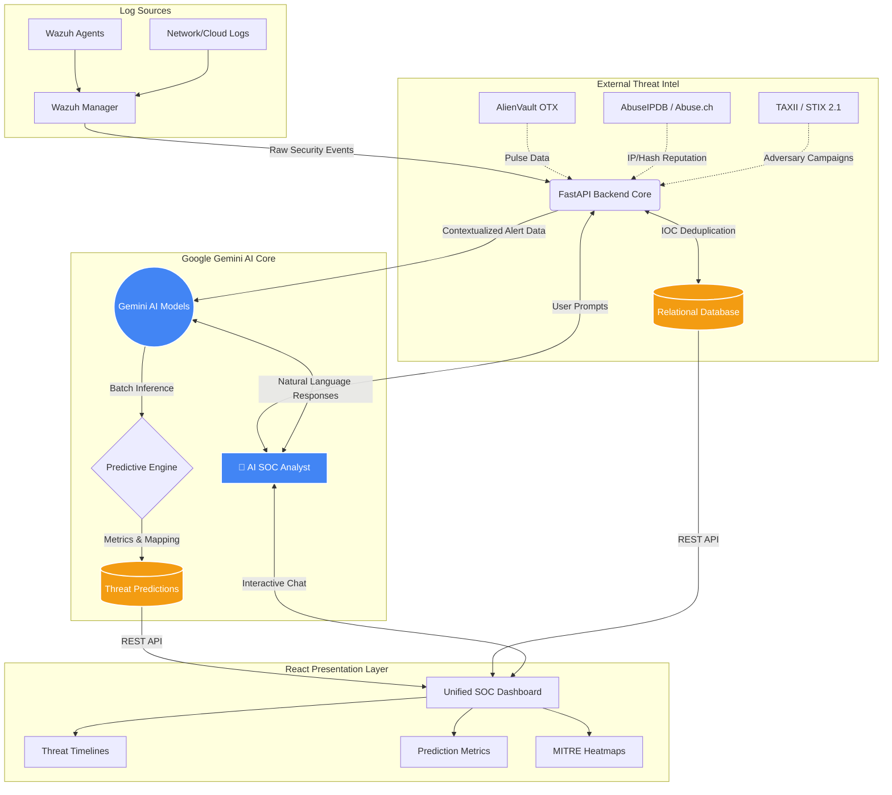

<div align="center">

# 🛡️ Wazuh-TI 
### **AI-Driven Threat Intelligence & Predictive Analytics Platform for Next-Gen SIEM**

[](https://fastapi.tiangolo.com/)
[](https://reactjs.org/)
[](https://www.docker.com/)
[](https://wazuh.com/)
[](https://deepmind.google/technologies/gemini/)
[](https://opensource.org/licenses/MIT)

*Elevating Security Operations Centers (SOC) with real-time threat enrichment, automated MITRE ATT&CK mapping, and Gemini-powered predictive threat modeling.*

---
</div>

## 📖 Table of Contents
- [The Problem vs. The Solution](#-the-problem-vs-the-solution)
- [Core Platform Modules](#-core-platform-modules)
  - [Predictive Threat Analytics (AI Pipeline)](#1-predictive-threat-analytics-ai-pipeline)
  - [Conversational AI Analyst](#2-conversational-ai-analyst)
  - [OSINT Ingestion Engine](#3-osint-ingestion-engine)
- [Platform Architecture](#-platform-architecture)
- [Technical Stack](#-technical-stack)
- [Repository Structure](#-repository-structure)
- [Getting Started (Installation)](#-getting-started)
- [Environment Configuration](#-environment-configuration)
- [Future Roadmap](#-future-roadmap)
- [License & Author](#-license--author)

<br/>

## 🌌 The Problem vs. The Solution

**The Problem:** Modern SOC analysts are drowning in alert fatigue. Standard SIEMs like Wazuh generate thousands of raw logs daily, requiring manual triage, disjointed OSINT lookups, and reactive incident response. Security teams waste hours chasing false positives while critical threats slip through the cracks.

**The Solution:** **Wazuh-TI** bridges the gap between raw data and actionable intelligence. By seamlessly integrating external threat feeds (STIX/TAXII, OTX, Abuse.ch) and feeding them into Google's advanced Gemini AI models, Wazuh-TI transforms chaotic alerts into prioritized, human-readable threat narratives *before* a breach materializes.

<br/>

## ✨ Core Platform Modules

Wazuh-TI is broken down into three major functional pillars:

### 1. Predictive Threat Analytics (AI Pipeline)
Wazuh-TI doesn't just tell you what happened; it tells you **what will happen next** and **how much you should care**. Every ingested Wazuh alert runs through our batch inference engine to generate:

> **Contextual Risk Score (0-100) & Priority:** Context-aware scoring combining indicator confidence, host criticality, and attack severity.
> **Materialization Probability:** Statistical likelihood that the current isolated alert will evolve into a full-scale network compromise.
> **Predicted Next Attack Stage:** Anticipatory mapping of the attacker's next move on the **MITRE ATT&CK framework** (e.g., predicting *Privilege Escalation* following *Initial Access*).
> **Actionable Recommendations:** Automated, context-specific mitigation steps tailored to your infrastructure, ready for immediate SOC execution.

### 2. Conversational AI Analyst
Say goodbye to writing complex query syntax. Wazuh-TI features a native **🤖 AI SOC Analyst Agent** integrated directly into the React dashboard.
- **Natural Language Queries:** Ask the system "Show me all critical alerts targeting the DB server today" or "Summarize the latest brute-force campaign."
- **Deep Investigations:** The agent has full access to the threat database, OSINT context, and Wazuh logs, acting as a tireless Level 2 SOC Analyst.
- **Instant Reporting:** Generate executive summaries of ongoing incidents in seconds.

### 3. OSINT Ingestion Engine
Wazuh-TI natively aggregates, deduplicates, and correlates data from multiple industry-leading sources to enrich local logs:
- **TAXII / STIX 2.1 Servers:** Pulls standardized threat campaigns and attack patterns.
- **AlienVault OTX:** Ingests community-driven threat pulses and IOCs.
- **Abuse.ch & AbuseIPDB:** Integrates specialized malware, botnet tracking, and real-time IP reputation scoring.

<br/>

## 📐 Platform Architecture

The data flow ensures real-time processing and immediate presentation to the security team.



<br/>

## 🛠️ Technical Stack

Wazuh-TI is built with modern, high-performance tooling to ensure zero bottlenecking during massive log surges.

| Layer | Technologies Used | Why We Chose It |
| :--- | :--- | :--- |
| **Backend Core** | Python 3.11, FastAPI | Asynchronous capabilities make it perfect for handling thousands of rapid webhook alerts from Wazuh. |
| **Database ORM** | SQLAlchemy, SQLite/PostgreSQL | Robust schema management for complex STIX/TAXII relationships and ML predictions. |
| **Frontend UI** | React 19, Vite, Tailwind CSS | Lightning-fast HMR (Hot Module Replacement) and scalable component architecture for the SOC dashboard. |
| **Data Viz** | Recharts, Lucide Icons | Smooth, interactive SVG charting for MITRE heatmaps and timeline graphs. |
| **AI / ML** | Google Generative AI SDK | `gemini-3-flash-preview` offers unmatched reasoning speed for real-time alert triage. |
| **Infrastructure** | Docker & Docker Compose | Guarantees environmental parity across dev, staging, and production. |

<br/>

## 📁 Repository Structure

```text
STIX-TAXII-Integration-in-Wazuh/
├── app/                  # FastAPI Backend Core
│   ├── api/routes/       # REST API endpoints (sync, ai, stats)
│   ├── core/             # Business logic & Pipeline scheduling
│   ├── db/               # SQLAlchemy Models & Migrations
│   └── main.py           # Application entrypoint
├── frontend/             # React + Vite Frontend
│   ├── src/components/   # Reusable UI widgets & Layouts
│   ├── src/pages/        # Dashboard, AI Analyst, Settings views
│   └── src/api/          # Axios client config for backend comms
├── simulation/           # Mock data generators & test agents
│   └── docker-compose.simulation.yml 
├── wazuh-integrations/   # Custom Wazuh integration scripts
├── wazuh-rules/          # Wazuh detection rules (XML)
├── docker-compose.yml    # Main orchestration file
└── config.yaml           # Platform runtime configuration
```

<br/>

## 🚀 Getting Started

### Prerequisites
*   Docker & Docker Compose installed on your host machine.
*   An active Wazuh Manager deployment (v4.x+).
*   API Keys for **Google Gemini AI**, **AlienVault OTX**, and **AbuseIPDB**.

### Step-by-Step Installation

1. **Clone the repository:**
   ```bash
   git clone https://github.com/Syed-Saadan-Uddin/STIX-TAXII-Integration-in-Wazuh.git
   cd STIX-TAXII-Integration-in-Wazuh
   ```

2. **Configure Environment Variables:**
   ```bash
   cp .env.example .env
   ```
   Open the `.env` file and securely add your required API keys (see [Environment Configuration](#-environment-configuration) below).

3. **Deploy the Platform via Docker:**
   ```bash
   docker-compose up -d --build
   ```
   *This spins up the FastAPI backend, the React frontend, and mounts necessary volumes to your Wazuh instance.*

4. **Access the SOC Dashboard:**
   Open your browser and navigate to `http://localhost:8000`. You will be greeted by the Wazuh-TI unified dashboard.

<br/>

## ⚙️ Environment Configuration

The platform relies on several environment variables defined in the `.env` file. Below is a detailed breakdown:

| Variable | Description | Required | Default |
| :--- | :--- | :--- | :--- |
| `GEMINI_API_KEY` | Your Google AI Studio API key for threat predictions and the AI Analyst. | **Yes** | `None` |
| `GEMINI_MODEL` | The specific Gemini model version to utilize. | No | `gemini-3-flash-preview` |
| `OTX_API_KEY` | AlienVault OTX API key for fetching threat pulses. | **Yes** | `None` |
| `ABUSEIPDB_API_KEY` | AbuseIPDB key for real-time IP reputation checks. | No | `None` |
| `ENCRYPTION_KEY` | Fernet symmetric key for encrypting TAXII server credentials in the DB. | **Yes** | *Generate securely* |
| `LOG_LEVEL` | Application logging verbosity (DEBUG, INFO, WARNING, ERROR). | No | `INFO` |

<br/>

## 🛣️ Future Roadmap

We are constantly pushing the boundaries of what open-source Threat Intelligence can achieve. Here is what is coming next:

- [ ] **Auto-Remediation Webhooks:** Direct integration back into Wazuh Active Response to automatically block IPs or isolate hosts based on AI confidence scores > 90%.
- [ ] **Local LLM Support:** Integration with Ollama to support completely air-gapped deployments using models like Llama 3 or Mistral.
- [ ] **Graph Database Integration:** Migrating complex IOC relationship tracking to Neo4j to visualize sprawling attack campaigns.
- [ ] **Multi-Tenant Support:** Enabling MSSPs to manage discrete client environments from a single Wazuh-TI instance.

<br/>

## 👨‍💻 License & Author

**Developed and Maintained by:** [Syed Saadan Uddin](https://github.com/Syed-Saadan-Uddin)

This project is open-source and distributed under the **MIT License**. See the `LICENSE` file for full terms and conditions.

---
<div align="center">
  <sub>Built to push the boundaries of open-source Threat Intelligence and Security Operations.</sub>
</div>
