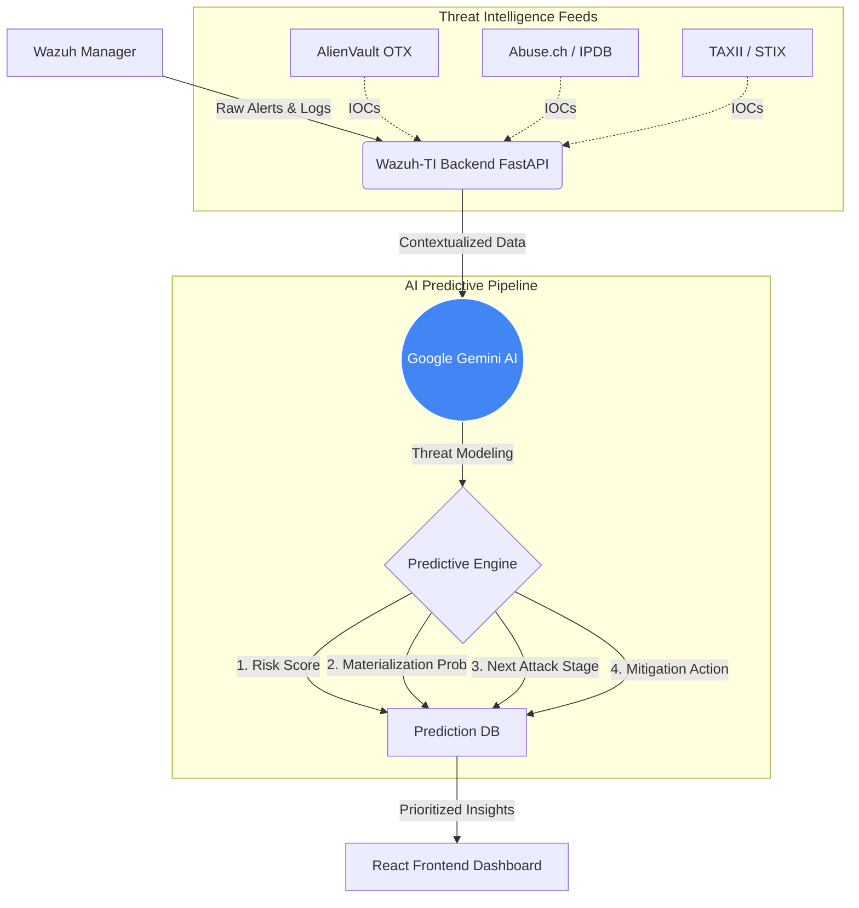

<div align="center">

# 🛡️ Wazuh-TI 
### **AI-Driven Threat Intelligence & Predictive Analytics for Next-Gen SIEM**

[](https://fastapi.tiangolo.com/)
[](https://reactjs.org/)
[](https://www.docker.com/)
[](https://wazuh.com/)
[](https://deepmind.google/technologies/gemini/)
[](https://opensource.org/licenses/MIT)

*Elevating Security Operations Centers (SOC) with real-time threat enrichment, automated MITRE ATT&CK mapping, and Gemini-powered predictive threat modeling.*

---
</div>

## 🌌 The Problem vs. The Solution

**The Problem:** Modern SOC analysts are drowning in alert fatigue. Standard SIEMs like Wazuh generate thousands of raw logs daily, requiring manual triage, disjointed OSINT lookups, and reactive incident response. 

**The Solution:** **Wazuh-TI** bridges the gap between raw data and actionable intelligence. By seamlessly integrating external threat feeds (STIX/TAXII, OTX, Abuse.ch) and feeding them into Google's advanced Gemini AI models, Wazuh-TI transforms chaotic alerts into prioritized, human-readable threat narratives *before* a breach materializes.

<br/>

## 🔮 Predictive Threat Analytics (The AI Advantage)

Wazuh-TI doesn't just tell you what happened; it tells you **what will happen next** and **how much you should care**. Every ingested alert runs through our AI pipeline to generate:

> **1. Contextual Risk Score (0-100) & Priority:** 
> Context-aware scoring combining indicator confidence, host criticality, and attack severity.

> **2. Materialization Probability:** 
> Statistical likelihood that the current isolated alert will evolve into a full-scale network compromise.

> **3. Predicted Next Attack Stage:** 
> Anticipatory mapping of the attacker's next move on the **MITRE ATT&CK framework** (e.g., predicting *Privilege Escalation* following *Initial Access*).

> **4. Actionable Recommendations:** 
> Automated, context-specific mitigation steps tailored to your infrastructure, ready for immediate SOC execution.

<br/>

## ✨ Core Platform Features

- 🧠 **Zero-Shot Threat Prioritization:** Leverage the reasoning capabilities of `gemini-3-flash-preview` / `pro` to drastically reduce false positives.
- ⚡ **Automated OSINT Enrichment:** Real-time, scheduled ingestion and correlation of IOCs (Indicators of Compromise) from leading global feeds.
- 🗺️ **Native MITRE ATT&CK Mapping:** Automatically maps identified threat behaviors to MITRE tactics and techniques for strategic defense planning.
- 📊 **Stunning SOC Dashboard:** A sleek, dark-mode React + Tailwind CSS frontend providing a bird's-eye view of your organizational security posture.
- 🐳 **Containerized & Scalable Architecture:** Fully dockerized for painless deployment, scaling effortlessly alongside your existing Wazuh manager.

<br/>

## 📡 Threat Intelligence Integrations

Wazuh-TI natively aggregates, deduplicates, and correlates data from multiple industry-leading sources:

*   **TAXII / STIX 2.1 Servers:** Standardized threat data sharing.
*   **AlienVault OTX:** Community-driven threat intelligence.
*   **Abuse.ch:** Specialized malware and botnet tracking.
*   **AbuseIPDB:** Real-time IP reputation scoring.

<br/>

## 📐 Platform Architecture



<br/>

## 🛠️ Technology Stack

| Layer | Technologies Used |
| :--- | :--- |
| **Backend API** | Python 3.11+, FastAPI, SQLAlchemy (ORM), Pydantic |
| **Frontend UI** | React 19, Vite, Tailwind CSS, Recharts, Lucide Icons |
| **AI / ML** | Google Generative AI SDK (`gemini-3-flash-preview`) |
| **Infrastructure** | Docker, Docker Compose, SQLite (Data Store) |

<br/>

## 🚀 Getting Started

### Prerequisites
*   Docker & Docker Compose installed.
*   An active Wazuh Manager deployment.
*   API Keys for **Google Gemini AI**, **AlienVault OTX**, and **AbuseIPDB**.

### Installation

1. **Clone the repository:**
   ```bash
   git clone https://github.com/Syed-Saadan-Uddin/STIX-TAXII-Integration-in-Wazuh.git
   cd STIX-TAXII-Integration-in-Wazuh
   ```

2. **Configure Environment Variables:**
   ```bash
   cp .env.example .env
   ```
   *Edit `.env` and securely add your required API keys.*

3. **Deploy the Platform:**
   ```bash
   docker-compose up -d --build
   ```

4. **Access the SOC Dashboard:**
   Open your browser and navigate to `http://localhost:8000`.

<br/>

## 🛣️ Future Roadmap
- [ ] Auto-remediation webhook integration directly back into Wazuh Active Response.
- [ ] Support for open-source local LLMs (Llama 3 / Mistral) via Ollama.
- [ ] Graph database integration for advanced IOC relationship mapping.

<br/>

## 👨‍💻 Author & License

**Developed by:** [Syed Saadan Uddin](https://github.com/Syed-Saadan-Uddin)

This project is distributed under the **MIT License**. See the `LICENSE` file for more details.

---
<div align="center">
  <sub>Built to push the boundaries of open-source Threat Intelligence.</sub>
</div>
