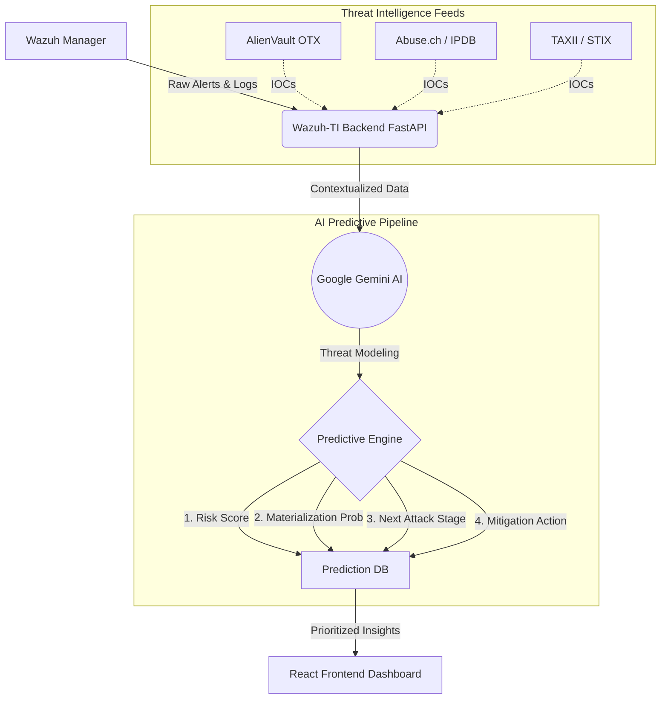

<div align="center">

# 🛡️ Wazuh-TI 
### **AI-Driven Threat Intelligence for Next-Gen SIEM**

[](https://fastapi.tiangolo.com/)
[](https://reactjs.org/)
[](https://www.docker.com/)
[](https://wazuh.com/)
[](https://deepmind.google/technologies/gemini/)

*Elevate your SOC with real-time threat enrichment, automated MITRE ATT&CK mapping, and Gemini-powered threat prioritization.*

---
</div>

## 🌌 Overview

**Wazuh-TI** supercharges your Wazuh SIEM deployment by seamlessly integrating external threat intelligence feeds and cutting-edge artificial intelligence. Say goodbye to alert fatigue and hello to actionable, context-rich security insights. 

By pulling data from trusted sources like **AlienVault OTX**, **Abuse.ch**, **AbuseIPDB**, and **TAXII servers**, and analyzing it via **Google Gemini AI**, Wazuh-TI transforms raw logs into prioritized, human-readable threat narratives.

<br/>

## ✨ Key Features

- 🧠 **AI-Driven Threat Predictions:** Utilizes Google's Gemini models (`gemini-3-flash-preview` / `pro`) and ML pipelines to analyze alerts and dynamically predict 4 key metrics:
  - **Threat Priority & Risk Score**
  - **Materialization Probability** (Likelihood of actual compromise)
  - **Predicted Next Attack Stage** (Anticipating attacker movement)
  - **Recommended Mitigation Actions** (Automated response guidance)
- ⚡ **Automated Enrichment:** Real-time ingestion and correlation of IOCs (Indicators of Compromise) from leading OSINT feeds.
- 🗺️ **MITRE ATT&CK Integration:** Automatically maps threat behaviors to MITRE tactics and techniques for strategic defense planning.
- 📊 **Stunning Dashboard:** A sleek, responsive React + Tailwind CSS frontend providing a bird's-eye view of your security posture.
- 🐳 **Containerized Architecture:** Fully dockerized for painless deployment and scaling alongside your existing Wazuh manager.

<br/>

## 🔮 Predictive Threat Analytics

Wazuh-TI doesn't just tell you what happened; it tells you **what will happen next** and **how much you should care**. Every ingested alert runs through our AI pipeline to generate:

1. **Risk Score (0-100) & Priority:** Context-aware scoring combining indicator confidence, host criticality, and attack severity.
2. **Materialization Probability:** Statistical likelihood that the current alert will evolve into a full-scale compromise.
3. **Next Attack Stage:** Predictive mapping of the attacker's next move on the MITRE ATT&CK framework (e.g., *Privilege Escalation* following *Initial Access*).
4. **Actionable Recommendations:** Automated, context-specific mitigation steps tailored to your infrastructure.

<br/>

## 🛠️ Tech Stack

### **Backend**
*   **Python 3.11+**
*   **FastAPI** (High-performance API)
*   **SQLAlchemy** (Database ORM)
*   **Google Generative AI SDK**

### **Frontend**
*   **React 19**
*   **Vite** (Next-generation frontend tooling)
*   **Tailwind CSS** (Utility-first styling)
*   **Recharts** (Data visualization)

### **Infrastructure**
*   **Docker & Docker Compose**

<br/>

## 🚀 Getting Started

### Prerequisites

*   Docker & Docker Compose
*   An active Wazuh Manager deployment
*   API Keys for:
    *   Google Gemini AI
    *   AlienVault OTX
    *   Abuse.ch / AbuseIPDB (Optional but recommended)

### Installation

1. **Clone the repository:**
   ```bash
   git clone https://github.com/Syed-Saadan-Uddin/STIX-TAXII-Integration-in-Wazuh.git
   cd STIX-TAXII-Integration-in-Wazuh
   ```

2. **Configure Environment Variables:**
   Copy the example environment file and add your API keys.
   ```bash
   cp .env.example .env
   ```
   *Edit `.env` and fill in your keys.*

3. **Fire it up:**
   ```bash
   docker-compose up -d --build
   ```

4. **Access the Dashboard:**
   Open your browser and navigate to `http://localhost:8000`.

<br/>

## 📐 Architecture



<br/>

## 🤝 Contributing

Contributions, issues, and feature requests are welcome! Feel free to check the [issues page](https://github.com/Syed-Saadan-Uddin/STIX-TAXII-Integration-in-Wazuh/issues).

1. Fork the Project
2. Create your Feature Branch (`git checkout -b feature/AmazingFeature`)
3. Commit your Changes (`git commit -m 'Add some AmazingFeature'`)
4. Push to the Branch (`git push origin feature/AmazingFeature`)
5. Open a Pull Request

<br/>

## 📜 License

Distributed under the MIT License. See `LICENSE` for more information.

<br/>

<div align="center">
  <sub>Built with ❤️ by the open-source security community.</sub>
</div>
